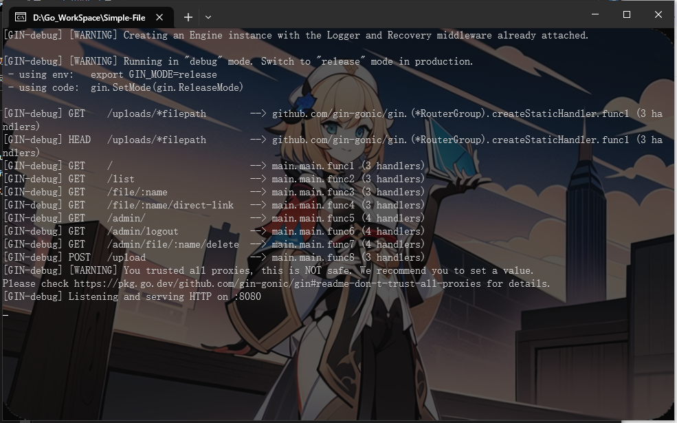
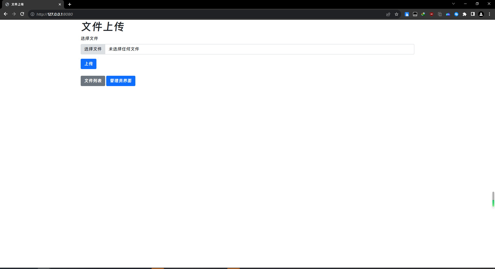

# 快速开始

> Simple-File-System-Admin 小白也可以轻松使用与管理

## 下载最新版
前往[Releases](https://github.com/ymh0000123/Simple-file-system-for-admin/releases)下载最新版

下载之后放到自己想放的位置

运行程序

运行之后如下图

>默认访问地址是http://localhost:8080

用浏览器打开http://localhost:8080

打开之后如上图

>默认的用户名是admin 密码是123456
